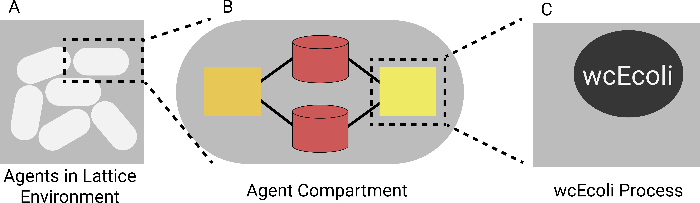

# Modeling Colonies with wcEcoli

[Vivarium](https://github.com/CovertLab/vivarium) is an interface for
combining sub-models (termed *processes*) to construct composite models
that can be simulated in *experiments* using the Vivarium engine.

## Overview

See [Vivarium's documentation](https://wc-vivarium.rtfd.io) for a more
detailed description of how Vivarium works, but in brief, Vivarium
models consist of processes and stores. Stores hold data that defines
the current state of the simulation, and processes generate updates that
mutate the stores. Processes and stores form a bipartite graph called a
*topology* that defines which stores each process affects. The Vivarium
engine handles repeatedly getting updates from processes and applying
them to the stores to run the simulation. To allow for swapping
processes, each process defines *ports* that represent the stores it
expects to be linked to. The topology therefore links stores to process
ports.

To simulate *E. coli* colonies with wcEcoli, we use Vivarium to combine
a number of models:

* wcEcoli: Whole-cell model of *E. coli*
* Lattice: Discretized spatial environment where environmental
  metabolite concentrations are represented as matrices of
  concentrations for each cell of the environment. These concentrations
  are called fields. Cells are called agents and have positions in this
  environment, which determines which cell of the environment their
  influx and efflux (exchange) affects.
* Other Vivarium Processes: We can add in any number of other Vivarium
  processes, for example the antibiotic import and export processes used
  right now.



Above we see the lattice environment in panel A. Each cell is a Vivarium
*compartment* (a collection of linked processes and stores) with a
wcEcoli process and other processes, as shown in panel B. The stores are
the cylinders, and the rectangles are processes. In panel C, we see that
the wcEcoli process wraps the wcEcoli model (specifically an
`EcoliSimulation` object).

To get a good overview of the model, take a look at
`environment/wcecoli_compartment.py`. This imports all the models that
go into the cell compartment and defines the topology. To see how we
interface with wcEcoli, look at `environment/wcecoli_process.py`.

## Setup

1. To run simulations, you need to have the `sim_data` files. You can
   generate them like this:

    ```console
    PYTHONPATH="$PWD" python runscripts/manual/runParca.py
    ```

Vivarium was already installed as a Python package when you setup
wcEcoli.  If you are going to be developing on wcEcoli and Vivarium
simultaneously, you may want to build Vivarium locally instead. You can
do this by cloning the Vivarium repository and running `python setup.py
sdist`. This will generate a zip archive you can install into your
wcEcoli environment with `pip install /path/to/archive`.

## Running Simulations

The model in this directory right now combines wcEcoli with antibiotic
import and export functions to model how colonies respond to
antibiotics. To run this simulation, just execute the experiment:

```
python environment/lattice_experiment.py
```

To see the available arguments, check out the help message:

```
python environment/lattice_experiment.py -h
```

If you are going to be running large simulations, you'll probably want
to run on Google Cloud. Note that this simulation will run each wcEcoli
cell on a separate CPU process, so you should get optimum performance
with about as many CPUs as wcEcoli cells.
