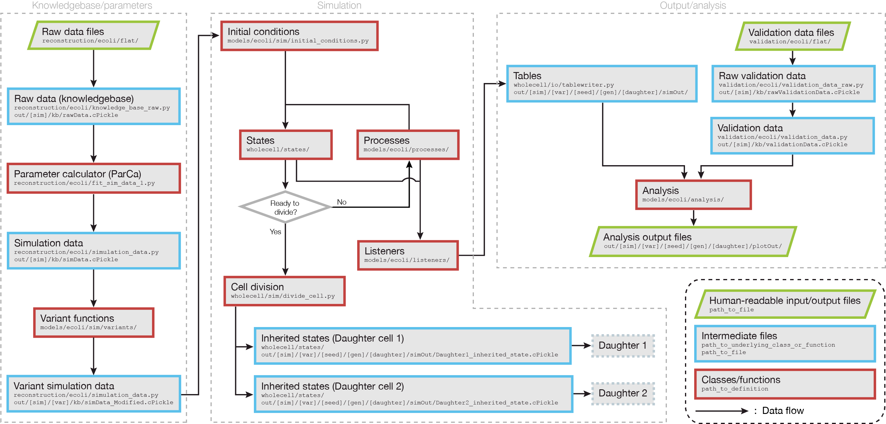

# Background on the Whole Cell Model


## Important source code and data locations



### Knowledgebase/parameters
Files to generate the `sim_data` object that contains all parameters needed to run simulations.
* `reconstruction/ecoli/...`
    * `flat/`: raw data files
    * `dataclasses/`: classes for organizing data related to processes and states
    * `knowledge_base_raw.py`: script to load raw data
    * `simulation_data.py`: class of the `sim_data` object
    * `fit_sim_data_1.py`: script to calculate parameters from raw data to produce the `sim_data` object required for simulations

### Simulation/analysis
* `models/ecoli/...`
    * `processes/`: files to simulate physiological processes
    * `listeners/`: files to record data to disk during simulations
    * `analysis/`: files to analyze simulation output
    * `sim/variants/`: files that modify `sim_data` for running experiments on modified parameters
    * `sim/initial_conditions.py`: initializes cell states before simulation
    * `sim/simulation.py`: specifies classes that make an _E. coli_ simulation

### Utilities
General tools that are not _E. coli_ specific.
* `wholecell/...`
    * `fireworks/firetasks/`: handles inputs, outputs and options for the execution of tasks in a simulation workflow (eg. calculating parameters, running simulations, performing analysis)
    * `tests/`: test scripts to ensure proper functionality
    * `states/`: classes representing cell states used in simulations
    * `sim/simulation.py`: main simulation file handling states, processes, listeners and updates between them

### Validation data
This data will only be accessed during analysis and not during simulations.
* `validation/ecoli/...`
    * `flat/`: raw data files
    * `validation_data_raw.py`: script to load raw data
    * `validation_data.py`: script to process and organize raw data

### Cloud
* `cloud/...`
    * `docker/`: Dockerfiles for building Docker containers to run simulations
    * `build*.sh`: scripts to run Docker builds

### Runscripts
Scripts used as entry points for executing workflows, performing analysis or generating/cleaning data.
* `runscripts/...`
    * `reconstruction/`: scripts for processing data sources to `*.tsv` files in `reconstruction/ecoli/flat/`
    * `jenkins/`: scripts to test codebase through continuous integration (CI)
    * `manual/`: scripts for running portions of workflows interactively
    * `cloud/wcm.py`: used to make Docker fireworks workflows to run locally or on Google compute engine
    * `fireworks/fw_queue.py`: used to make fireworks workflows to run locally or on Sherlock

## Analysis

Analysis plots will use sim_data generated by the parca, data from sims stored in listeners and can compare to validation data withheld from simulations.  See [models/ecoli/analysis/](https://github.com/CovertLab/wcEcoli/tree/master/models/ecoli/analysis) for all the analysis scripts.

TODO: add schematic to show groupings for single/multigen/cohort/variant analysis

### Single
Analysis to be performed on a single simulation (for each variant, seed, generation and daughter).  This is typically detailed information about each sim.

### Multigen
Analysis to be performed on multiple generations starting with a single parent (for each variant and seed).  This is typically to see trends and evolution over time/many generations.

### Cohort
Analysis to be performed across multiple generations that were initialized with a different random seed (for each variant).  This is typically to see variability from initial conditions and stochastic events.

### Variant
Analysis to be performed on all sims run together in order to compare effects from sim_data modifications (only run for the entire set of sims).  Each analysis script is typically created for a specific simulation variant to show the output differences from using different parameter values.

### Causality network
Create data series for interactive exploration of data through the Fathom [visualization tool](https://github.com/CovertLab/causality).

After generating data series, display the data by running the following command from the cloned repo with the proper path for your simulation output:
```
python site/server.py ~/wcEcoli/out/manual/kb ~/wcEcoli/out/manual/wildtype_000000/000000/generation_000000/000000/seriesOut
```

Alternatively, you can set your environment variable `$CAUSALITY_SERVER` as the path to `site/server.py` in the Causality repo (TIP: add this to your `.bash_profile`) and run the manual runscript with the `--show` flag from this repo to automatically display the data generated and allow for easier selection of specific seeds/generations etc:
```
export CAUSALITY_SERVER="~/path/to/causality/site/server.py"
python runscripts/manual/buildCausalityNetwork.py --show
```

Useful network topologies are saved in [models/ecoli/analysis/causality_network/saved_networks](https://github.com/CovertLab/wcEcoli/tree/master/models/ecoli/analysis/causality_network/saved_networks). Saved topologies can be loaded and new topologies can be saved through the web interface after running the `python site/server.py ...` or `python runscripts/manual/buildCausalityNetwork.py --show` commands from above.  If a newly saved topology is useful for the team, check it in with a new commit.

### Parca
Analysis to be performed on `raw_data`, `sim_data` and `validation_data` only.  This does not require any simulation output and is only run once after the parca has run to visualize raw data and processed data.

## Adding to the codebase
The sections below provide step by step guides for adding different components to the whole-cell model.  After completing one of these sections, you will want to create a pull request (PR) for review before merging the code into master.  Some guidelines for creating a PR are listed below:
- Follow style guidelines in [our style guide](https://github.com/CovertLab/wcEcoli/blob/master/docs/style-guide.md) for consistent code
- Create a new branch from master (or another branch), add your new commits and push it to GitHub.  For help with git or GitHub consider the following useful link: [Git Book](https://git-scm.com/book/en/v2) (mostly Ch. 1-3 and 6-8 for more advanced use cases),
- Create a descriptive title of the changes, similar to a commit message.
- Each PR should be a relatively concise set of changes.  Related and dependent changes can be grouped together but there should not be a lot of new features in a single PR.  Large, unrelated changes make it harder to review and track down bugs that are later found to be introduced with a PR.
- PRs should be tested and working - CI will run a quick test to make sure no errors pop up but output should be checked to see if it is reasonable.
- Wait for CI to pass (will show a green check mark and say all checks have passed on your PR) and give others a reasonable amount of time to review before merging into master.
- Ideally perform a 'squash and merge' to merge into master for a simpler commit history for easier debugging when reviewing past changes.  This also makes it easier to see which PR led to the changes for additional information and does not insert commits in the commit history like a normal merge will do.  After clicking 'squash and merge' you will be able to edit the commit message - remove empty lines and unhelpful commit messages (eg 'fix typo', 'address comments' etc). If you want to keep individual commits, performing a 'rebase and merge' is preferred to 'create a merge commit' since it will also prevent disrupting the commit history order that normal merging can cause.
- If you want to build new features on top of a pending PR, feel free to start working on another branch from that PR branch.  You might need to rebase on master or merge master into your new branch once those changes are merged in especially if review comments lead to changes.

### New raw data
Raw data should always be annotated with the source and process used to generate it for reproducibility.  The best way is to include it in the file as noted below and described in the PR that incorporates the data into the repo.  Adding several data files and scripts to a runscript directory could also use a README.md if desired to point to sources and describe how to run the scripts/what output to expect.
1. Add a raw data file to [reconstruction/ecoli/flat/](https://github.com/CovertLab/wcEcoli/tree/master/reconstruction/ecoli/flat). Data is stored in a `.tsv` file format with special formatting handling to allow units (specified in parentheses in column headers), lists, dictionaries and comments (lines starting with `#`).
1. Annotate where the data came from in a comment at the top of the file (URL for the data source and/or script used for processing original data - [see example](https://github.com/CovertLab/wcEcoli/blob/master/reconstruction/ecoli/flat/metabolism_kinetics.tsv)). If a script was required, add it to [runscripts/reconstruction](https://github.com/CovertLab/wcEcoli/tree/master/runscripts/reconstruction).
1. Add the filename to `LIST_OF_DICT_FILENAMES` in [knowledge_base_raw.py](https://github.com/CovertLab/wcEcoli/blob/master/reconstruction/ecoli/knowledge_base_raw.py). This will cause the data to be loaded into the class when an instance of `KnowledgeBaseEcoli` is created.
1. Access, process and store the data in the appropriate reconstruction class (eg [processes](https://github.com/CovertLab/wcEcoli/tree/master/reconstruction/ecoli/dataclasses/process) or [states](https://github.com/CovertLab/wcEcoli/tree/master/reconstruction/ecoli/dataclasses/state)) by accessing the `raw_data` attribute for the file (eg. `raw_data.new_file` for a file named `new_file.tsv`)

**NOTE:** if there are issues loading the new file, try saving it using `JsonWriter` from [reconstruction/spreadsheets.py](https://github.com/CovertLab/wcEcoli/blob/master/reconstruction/spreadsheets.py) to ensure proper formatting that can be read by `JsonReader`:
```python
from reconstruction.spreadsheets import JsonWriter

headers = ['a', 'b']
with open('output.tsv', 'w') as f:
    writer = JsonWriter(f, headers)
    writer.writeheader()
    writer.writerow({'a': 1, 'b': 2})  # write as many rows of data as needed
```

### New validation data
The steps to add validation data are very similar to that described in `New raw data` above but an important distinction to make between raw data and validation data is that validation data will not be used to calculate parameters or be used in simulations at all.  Validation data is only used to compare simulation results in analysis plots.  Additional information about file formatting and annotating in `New raw data` should also be considered here.
1. Add a validation data file to [validation/ecoli/flat/](https://github.com/CovertLab/wcEcoli/tree/master/validation/ecoli/flat).
1. Annotate where the data came from in a comment at the top of the file (URL for the data source and/or script used for processing original data - [see example](https://github.com/CovertLab/wcEcoli/blob/master/reconstruction/ecoli/flat/metabolism_kinetics.tsv)). If a script was required, add it to [runscripts/reconstruction](https://github.com/CovertLab/wcEcoli/tree/master/runscripts/reconstruction).
1. Add the filename to `LIST_OF_DICT_FILENAMES` in [validation_data_raw.py](https://github.com/CovertLab/wcEcoli/blob/master/validation/ecoli/validation_data_raw.py). This will cause the data to be loaded into the class when an instance of `ValidationDataRawEcoli` is created.
1. Access, process and store the data as an attribute in the appropriate class (or create a new class) in [validation_data.py](https://github.com/CovertLab/wcEcoli/blob/master/validation/ecoli/validation_data.py) by accessing the `validation_data_raw` attribute for the file (eg. `validation_data_raw.new_file` for a file named `new_file.tsv`)

### New process
Each _process_ models one part of the cell’s function, e.g. RNA polymerase elongation. They are modeled separately (modular), run in short time steps (assumed to be independent over a short time), and the results from each time step are integrated between processes before initiating the next time step.

Each process has three entry points during a simulation:
* _initialize_: called only once at the beginning of a simulation. Get needed parameters from the knowledge base, get views of bulk and unique molecules (bulk molecules are “indistinguishable” from each other, e.g. inactive RNAP molecules, unique molecules can be distinguished from each other, e.g. active RNAP molecules are each assigned to a location on the genome), create a view so that you can get counts, change counts, and change properties.
* _calculateRequest_: called at the beginning of each timestep. Request the resources that you want for that timestep (don’t request all unless you are certain that another process doesn’t need this resource as well, don’t forget about metabolism).
* _evolveState_: called after resources are allocated at each timestep. Perform the process, update counts, and update masses (mass must be conserved between steps).

Adding a process involves adding data to be used by that process in `reconstruction/` as well as code to model the process in `models/`.  The steps to add a new process called `new_process` are outlined below:
1. Add any required raw data (see 'New raw data' section above)
1. Create a new file called `new_process.py` in [reconstruction/ecoli/dataclasses/process/](https://github.com/CovertLab/wcEcoli/tree/master/reconstruction/ecoli/dataclasses/process).  This should include a class definition for `NewProcess` that loads data from `raw_data` to store as instance variables in an `__init__(self, raw_data, sim_data)` function.  See other files in the directory for an example.
1. Import the new reconstruction class and initialize an instance of it in [process.py](https://github.com/CovertLab/wcEcoli/blob/master/reconstruction/ecoli/dataclasses/process/process.py).  This will make the data in the previous step accessible with `sim_data.process.new_process`.
    ```
    from .new_process import NewProcess

            ...
            self.new_process = NewProcess(raw_data, sim_data)
            ...
    ```
1. Create a new file called `new_process.py` in [models/ecoli/processes/](https://github.com/CovertLab/wcEcoli/tree/master/models/ecoli/processes).  Add a class definition with the following functions as described above:
    ```
    class NewProcess(wholecell.processes.process.Process):
        """ NewProcess """

        _name = "NewProcess"

        def __init__(self):
            super(NewProcess, self).__init__()

        def initialize(self, sim, sim_data):
            super(NewProcess, self).initialize(sim, sim_data)

        def calculateRequest(self):

        def evolveState(self):
    ```
1. Import the new model class in [simulation.py](https://github.com/CovertLab/wcEcoli/blob/master/models/ecoli/sim/simulation.py) and add the class to one of the tuples in `_processClasses`.  Each tuple within `_processClasses` represents a set of processes that will all run before updating the cell state.  All processes within a tuple are assumed to be independent of each other and will request from the same pool of resources.  The tuples of processes will be executed in order so a process that requires all other processes to run first, should be in the last tuple.  One time step will be completed once all of the processes in each tuple have been run.  In most cases, a new class will be added to the first tuple.
    ```
    from models.ecoli.processes.new_process import NewProcess

    _processClasses = (
        (
            ...
            NewProcess,
            ...
        ),
    )
    ```
1. Add a function to [initial_conditions.py](https://github.com/CovertLab/wcEcoli/blob/master/models/ecoli/sim/initial_conditions.py) to approximate the function of the new process at steady state so that the initial cell state is representative of the state expected after the process runs.
1. (Optional) Add a new listener (see 'Add new listener' section) to save important information about the new process.
1. (Optional) Add new analysis plots (see 'Add new analysis' section) to show data from the new process.
1. Add documentation (.tex and .pdf) about the new process in [docs/processes/](https://github.com/CovertLab/wcEcoli/tree/master/docs/processes).

### New variant
Variants are used to compare changes to `sim_data` that cause different initialization and simulation conditions.  Each variant can be thought of as an experiment with the model and can be used to test a hypothesis, analyze sensitivity, and/or get a better understanding of parameters.  When running simulations, a range of variant indices can be selected with each one performing a different modification to `sim_data`.  The effect of each index will be determined by the function added in the steps below.  Variants are typically paired with one or more variant level analysis scripts in order to make the desired comparisons between changes in `sim_data`.  The following steps outline how to add a new variant called `new_variant.py`.
1. Create a new variant script in [models/ecoli/sim/variants/](https://github.com/CovertLab/wcEcoli/tree/master/models/ecoli/sim/variants) by copying the `template.py` file to a new filename that describes what your variant does.
    ```
    cp models/ecoli/sim/variants/template.py models/ecoli/sim/variants/new_variant.py
    ```
1. Update the new file at the points labeled `UPDATE:`.  You will want to update the docstring at the top, rename the function to match the filename, make modifications to `sim_data` based on the `index` argument, and return descriptions based on the changes made for the specific `index`.
1. Add an import statement and variant mapping (sorted in alphabetical order) to [models/ecoli/sim/variants/\_\_init\_\_.py](https://github.com/CovertLab/wcEcoli/tree/master/models/ecoli/sim/variants/__init__.py):
    ```
    from .new_variant import new_variant

    nameToFunctionMapping = {
        ...
        'new_variant': new_variant,
        ...
    ```
1. (Optional) Create a variant analysis script (see 'New analysis' section below) to analyze results of the new variant.

To run a manual simulation with the first two indices of the new variant:
```
python runscripts/manual/runSim.py --variant new_variant 0 1
```

### New listener

If you want to save new values to analyze after the simulation, you must write it out via a _listener_. Listeners log data during the simulation and can write attributes or columns. Attributes are values that are static throughout the simulation (eg. IDs) and only written once (usually at the beginning of simulations).  Columns are values that change and are written every time step (eg. number of reactions that occurred).  Listeners are organized to contain data that is similar to other data within the listener, often from the same process and used in the same analysis plots.  The following steps outline how to add a new listener:

1. Create a new file in [wcEcoli/models/ecoli/listeners/](https://github.com/CovertLab/wcEcoli/tree/master/models/ecoli/listeners), you can use other listeners in the directory as a template.  It should contain a class definition that inherits from `wholecell.listeners.listener.Listener`.
1. Complete the `initialize()` function.  This should save any values from `sim_data` or processes/states in `sim` that are required like IDs or number of expected attributes.  This function is called after processes have initialized so process attributes that are set during process `initialize()` calls can be accessed here.
1. Complete the `allocate()` function.  This should initialize values and types for columns.  The initial state of sims along with all listener values is written once before the evolution of a time step so these initial values will be the first entry in a column.
1. Complete the `tableCreate(self, tableWriter)` function.  This function is called once at the beginning of simulations and should define subcolumns (a dictionary that maps column name keys to values that contain an array with a corresponding ID for each entry in the column), write attributes (including subcolumns, if needed) using `tableWriter.writeAttributes()`, and define any columns that can be of variable length using `tableWriter.set_variable_length_columns()`.
1. (Optional) Complete the `update()` function.  This function is called a the end of each time step before values are written and should update any instance variables that will be written to file based on the current state.  Often, processes will set values to be written and this function is unnecessary.
1. Complete the `tableAppend(self, tableWriter)` function.  This function is called at the end of each time step after `update()` has been called and writes values for each column to file using `tableWriter.append()`.
1. Add the listener to [wcEcoli/models/ecoli/sim/simulation.py]().  You will need to import the class at the top of the file and add the class to the `_listenerClasses` tuple.
1. Save data during sims by calling `self.writeToListener('NewListener', 'new_column', value)` in a process to write a value to a column.  `value` can be a single value (float, str, etc) or a list/array of fixed length at every time step (unless `tableWriter.set_variable_length_columns()` was used in `tableCreate()` for the given `'new_column'`).
1. Load data during analysis plots by creating a table reader and reading the desired attribute or column, where `simOutDir` will be passed in to the `do_plot` function:
    ```
    from wholecell.io.tablereader import TableReader

    reader = TableReader(os.path.join(simOutDir, 'NewListener'))
    attribute = reader.readAttribute('new_attribute')
    column = reader.readColumn('new_column')
    ```

### New analysis
This outlines how to add a new single analysis plot called `new_analysis.py`.  For other types of analysis, only the directory needs to be changed.  New analysis plots might require additional simulation data to be saved to disk by adding entries to an existing listener or creating a new listener (see 'New listener' section above).
1. Decide which level of analysis is appropriate (single, multigen, cohort, variant - see 'Analysis' section above for differences between each).
1. Create a new file by copying  the `template.py` file in the directory for desired analysis type (single, multigen, cohort, variant) in [models/ecoli/analysis/](https://github.com/CovertLab/wcEcoli/tree/master/models/ecoli/analysis).
    ```
    cp models/ecoli/analysis/single/template.py models/ecoli/analysis/single/new_analysis.py
    ```
1. Add the new plot (`"new_analysis.py"`) to the desired lists in `__init__.py` in the appropriate analysis directory (eg [for single analysis](https://github.com/CovertLab/wcEcoli/blob/master/models/ecoli/analysis/single/__init__.py)).
    - Always add to `ACTIVE` so that continuous integration tests the new plot
    - If desired, add to `CORE` to run with default analysis if the new analysis is useful in most simulation circumstances
    - If desired, add to other lists in `TAGS` to run with groups of plots for more specific analysis (eg. `METABOLISM`, `TRANSCRIPTION`, `TRANSLATION`, etc.) when using the manual scripts with the `-p` flag.  For example, to run all plots in the METABOLISM tag for a sim in out/manual:
        ```
        python runscripts/manual/analysisSingle.py out/manual -p METABOLISM
        ```

### TODO: states - bulk, unique, environment (info about adding or describe how they fit in)

## Design factors

* One implicit modeling design goal is that no phenomena be modeled in more than one place over a given time interval -- exactly one place, if the model is complete.

* We have to be careful about degrees of representation. E.g. genes with known differential expression but no associated transcription factor do not currently change their expression during an environmental shift.

* A reproducible/testable way to show what is or isn't represented is via validation against some expected behavior or withheld data set.
